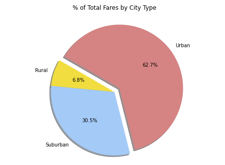

# Pyber Analysis

## Overview:
#
Conduct an in-depth data analysis of ride-sharing data for urban, suburban and rural cities between January 01, 2019 and April 28, 2019. Create visual representation of the data and provide stakeholders with three recommendations to help improve access to ride-sharing services and affordability to underserved neighboorhoods based on the findings.

### List of requested deliverables:
- Deliverable 1: A ride-sharing summary DataFrame by city type:
    * Total number of rides, total number of drivers, and the total fares for each city type.
    * Average fare per ride and average fare per driver for each city type.
- Deliverable 2: A multiple-line chart of total fares for each city type:
    * create a multiple-line graph that shows the total fares for each week by city type.
- Deliverable 3: A written report for the PyBer analysis (README.md):
    * Analysis of how to address any disparities in the ride-sharing data among the city types.

### Tools:
- GitBash
- Anaconda
- Jupyter Notebook
- Python
- Pandas
- Numpy
- Matplotlib
- Virtual Studio Code
#
## Results: 
#
### Pyber Dataframe Summary

 
 <figcaption> Fig. 1 - Pyber DataFrame Summary </figcaption>
 

### Rural
During the time period analyzed, there were a total of 125 rides in rural cities, a total of 78 drivers. The total fares was $4,327.93, makng the average fare per ride $34.62 and the average fare per driver $55.49.
 

### Suburban
During the time period analyzed, there were a total of 625 rides in suburban cities, a total of 490 drivers. The total fares was $19,356.33, makng the average fare per ride $30.97 and the average fare per driver $39.50.
 

### Urban
During the time period analyzed, there were a total of 1,625 rides in urban cities, a total of 2,405 drivers. The total fares was $39,854.38, makng the average fare per ride $24.53 and the average fare per driver $16.57.

 
 

### Total Rides by City Type:
 
 <figcaption> Fig. 2 - Total Rides by City Type </figcaption>
 

### Total Drivers by City Type:
 
 <figcaption> Fig. 3 - Total Drivers by City Type </figcaption>
 

### Total Fares by City Type:
 
 <figcaption> Fig. 4 - Total Fares by City Type </figcaption>
  

  
 <figcaption> Fig. 5 - Weekly Fare by Cty Type </figcaption>

While urban and suburban cities saw an increase in total fare from January to April, rural fare remained relatively the same. 
 

#
## Summary: 
#
### Total Fares by City Type:
 
 <figcaption> Fig. 6 - Total Number of rides, average fare and driver count. </figcaption>
  

As the graph above illustrates, rural cities have a smaller pool of drivers, a relatively small number of rides and a higher average fare. Comparetively, urban cities have a high number of rides, divided amongst a large number of drivers, and relatively low average fare.

Based on the data review, the following recommendations are proposed:

1) A further analysis of the timeframe of rides to see what times of the days have more demand based on city type. Based on results a surge system could be develop to incentivize drivers to move accross city types within those times of the day.  
2) To help increase accessbity and affordability of rides in rural cities, Pyber should look into implementing incentives for suburban and city drivers to service in these communities.
2) To help optimize cost benefit for urban rides, Pyber should consider a carpooling system based on most common traveled routes. This could generate potential savings for costumers while also providing drivers with higher fares while also reducing the amount of cars needed during rush hour, this could have significant impacts in travel times and polution emissions.